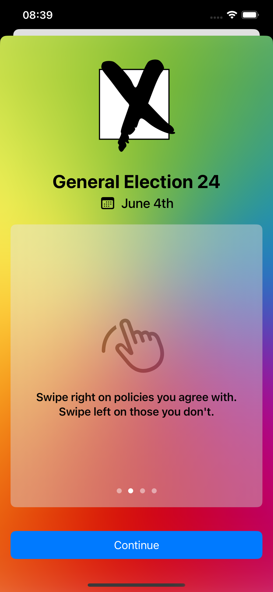
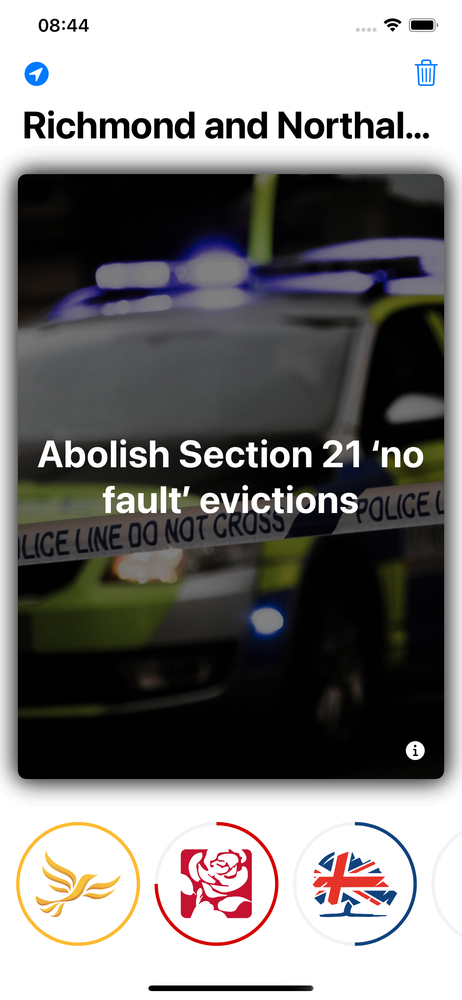
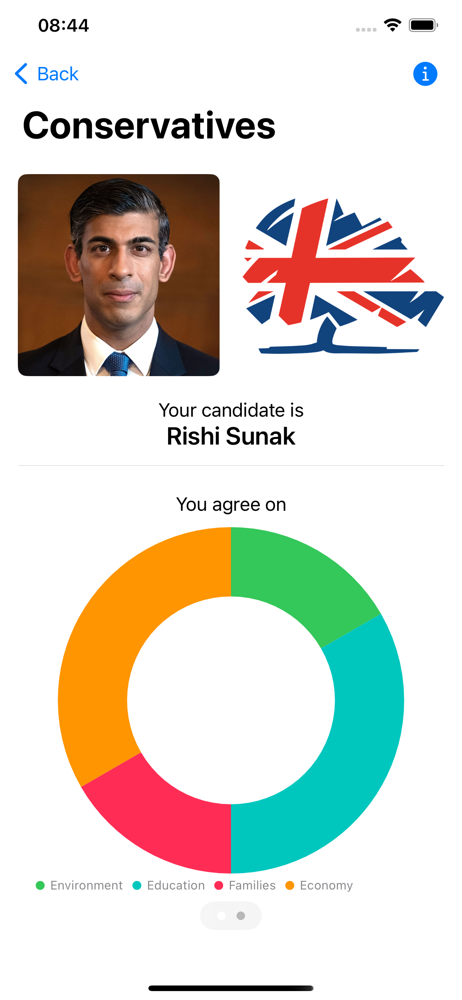

# General Election

Unsure who to vote for?
Use this helpful app to decide based on policies, not people.

Find out which political party you agree with the most.
You can then share your match with your friends using iMessage stickers.

||||
|-|-|-|

## Candidate Data

Candidate data is exported from Democracy Club's CSV export tool:

https://candidates.democracyclub.org.uk/data

It is converted from CSV to JSON using a script contained in this repository.

```bash
cd DataFormatting
swift run DataFormatting candidates candidates -o ../GeneralElection/Sources/Constituencies/Resources/candidates.json
```

## Policy Data

Policy data is compiled from the manifestos of each political party.

Use the DataFormatting Swift Package to create the `policy.json` file.

## Contributing

Pull requests and feature requests are welcome - this app is being developed fully in the open.

[Conventional Commits](https://www.conventionalcommits.org/en/v1.0.0/) are required for each pull request to ensure that release versioning can be managed automatically.
Please ensure that you have enabled the Git hooks, so that you don't get caught out!:
```
git config core.hooksPath hooks
```
